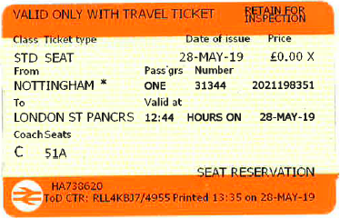

# Train ticket angular test

## Instructions

Create the train ticket below as a reusable angular component.

The aim of this task is not complete visual accuracy, but splitting the component into meaningful subcomponents.

### Extension

Create a form so that the user can add travel details and print a ticket.
The form should contain the following inputs:
- Price - positive number with maximum of `2 digits`
- From (Origin) - select with options:
    - London
    - Birmingham
    - Manchester
    - Leeds
    - Sheffield
    - Liverpool
    - Nottingham

When the form is submitted, the ticket should be displayed with details filled in the form.
Additional information that needs to show on the ticket:
- Ticket number: Auto generated unique number of 5 digits
- Date of issue: The date the form was submitted in `en-GB` formatting conventions
- Time of issue: The time the form was submitted in `en-GB` formatting conventions

Just set the remaining values to any constant value for the purposes of this test.

## Development server

Run `ng serve` for a dev server. Navigate to `http://localhost:4200/`. The app will automatically reload if you change any of the source files.

## Code scaffolding

Run `ng generate component component-name` to generate a new component. You can also use `ng generate directive|pipe|service|class|guard|interface|enum|module`.

## Build

Run `ng build` to build the project. The build artifacts will be stored in the `dist/` directory.

## Further help

To get more help on the Angular CLI use `ng help` or go check out the [Angular CLI Overview and Command Reference](https://angular.io/cli) page.
